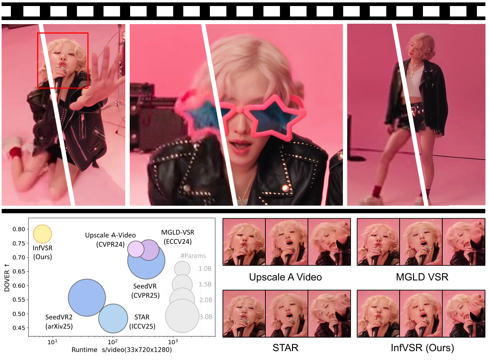
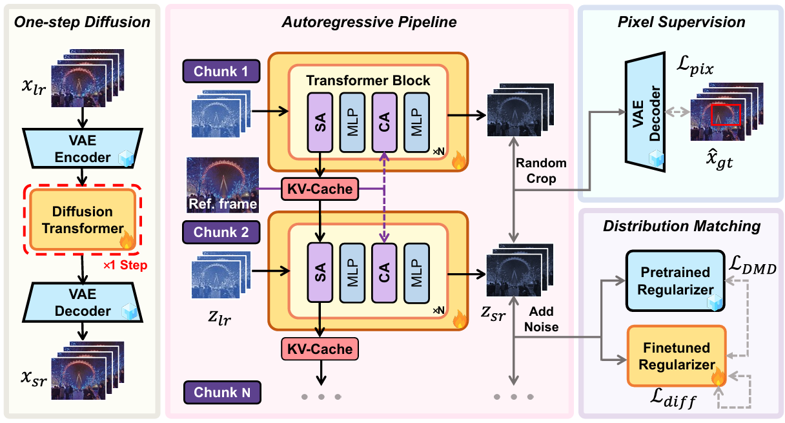
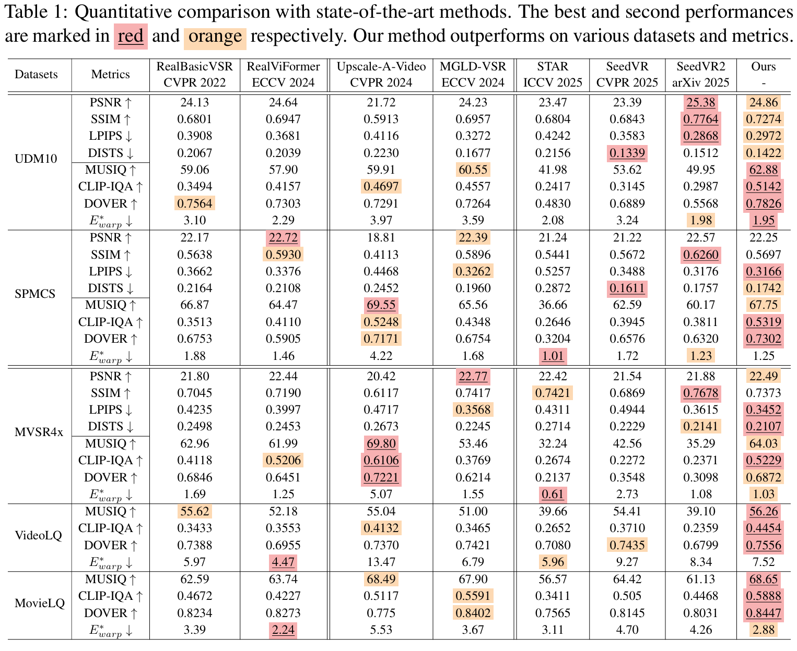
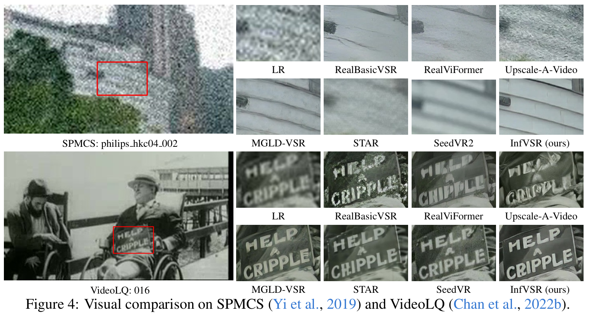
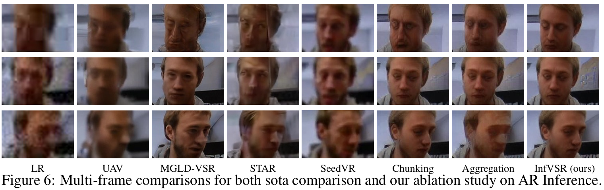
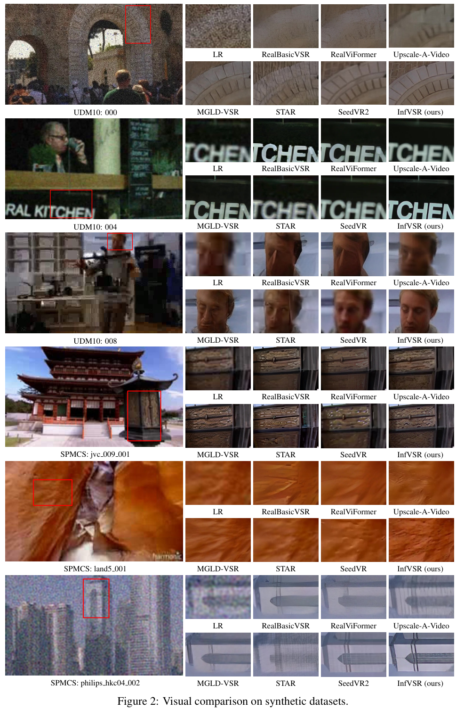
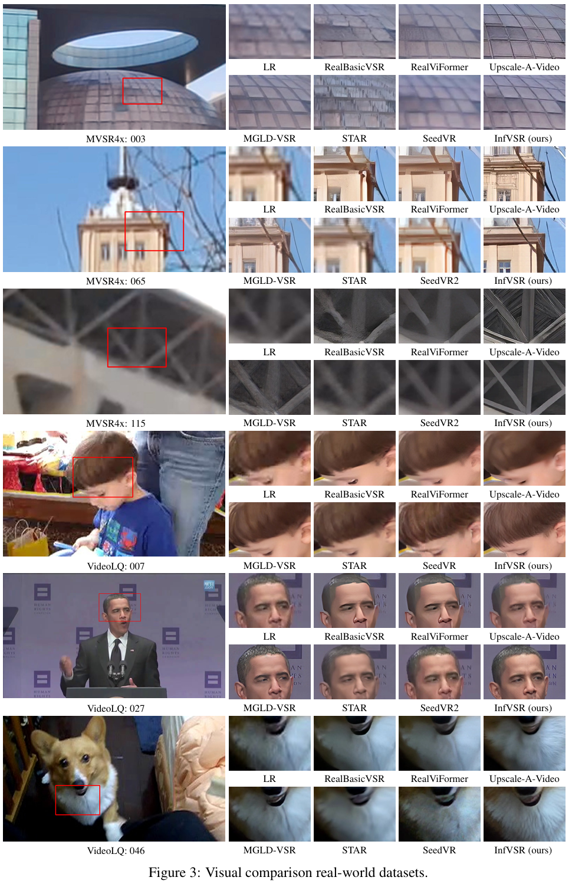

# InfVSR: Breaking Length Limits of Generic Video Super-Resolution

Ziqing Zhang, [Kai Liu](https://kai-liu001.github.io/), [Zheng Chen](https://zhengchen1999.github.io), [Xi Li](), [Yucong Chen](https://scholar.google.com/citations?user=BTEsUk8AAAAJ&hl), [Bingnan Duan](https://github.com/Bingnan), [Linghe Kong](https://www.cs.sjtu.edu.cn/~linghe.kong/), [Guihai Chen](https://cs.nju.edu.cn/gchen/index.htm),  and [Yulun Zhang](http://yulunzhang.com/), "InfVSR: Breaking Length Limits of Generic Video Super-Resolution", arXiv, 2025

[[arXiv]()] [[visual results]()] [[pretrained models]()]


#### 🔥🔥🔥 News
- **2025-09-25:** This repo is released. ⭐️⭐️⭐️

---

> **Abstract:** Real-world videos often extend over thousands of frames, posing unique demands far beyond current short benchmarks. Existing video super-resolution (VSR) approaches, however, face two persistent challenges when processing long sequences: (1) Efficiency due to the heavy cost of multi-step denoising for full-length sequences; and (2) Scalability hindered by temporal decomposition that causes artifacts and discontinuities. To break these limits, we propose InfVSR, which novelly reformulate VSR as an autoregressive-one-step-diffusion paradigm. This enables streaming inference while fully leveraging pre-trained video diffusion priors. First, we adapt the pre-trained DiT into a causal structure, maintaining both local and global coherence via rolling KV-cache and joint visual guidance. Second, we distill diffusion process into a single step efficiently, with patch-wise pixel supervision and cross-chunk distribution matching. Together, these designs enable efficient and scalable VSR for unbounded-length videos. To fill the gap in long-form video evaluation, we build a new benchmark tailored for extended sequences, and further introduce semantic-level metrics to comprehensively assess temporal consistency. Our method pushes the frontier of long-form VSR, achieves state-of-the-art quality with enhanced semantic consistency, and delivers up to 58x speed-up over existing methods such as MGLD-VSR. Code will be released soon.




---

## Contents


- [InfVSR: Breaking Length Limits of Generic Video Super-Resolution](#infvsr-breaking-length-limits-of-generic-video-super-resolution)
      - [🔥🔥🔥 News](#-news)
  - [Contents](#contents)
  - [Method](#method)
  - [Results](#results)
  - [Citation](#citation)

## <a name="method"></a> Method 

<p align="center">
  
</p>

## <a name="results"></a> Results

We achieved state-of-the-art performance. Detailed results can be found in the paper.

<details>
<summary>Click to expand</summary>

- quantitative comparisons in Table 3 (main paper)

<p align="center">
  
</p>


- visual comparison in Figure 4 (main paper)

<p align="center">
  
</p>


- visual comparison in Figure 6 (main paper)

<p align="center">
  
</p>


- visual comparison in Figure 2 (supplemental material)

<p align="center">
  
</p>

- visual comparison in Figure 3 (supplemental material)

<p align="center">
  
</p>

</details>

## <a name="citation"></a> Citation
If you find the code helpful in your research or work, please cite the following paper(s).

```
@inproceedings{Zhang2025infvsr,
    title={InfVSR: Breaking Length Limits of Generic Video Super-Resolution},
    author={Zhang, Ziqing and Liu, Kai and Chen, Zheng and Li, Xi and Chen, Yucong and Duan, Bingnan and Kong, Linghe and Chen, Guihai and Zhang, Yulun},
    booktitle={arXiv},
    year={2025}
}
```