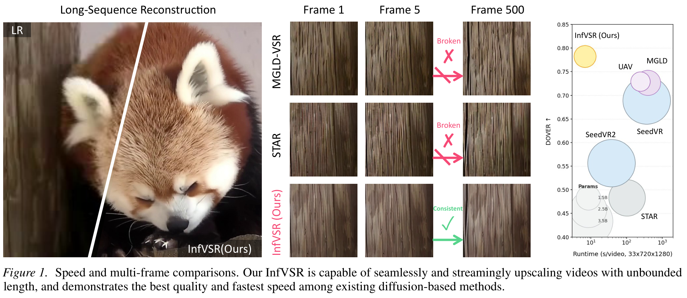
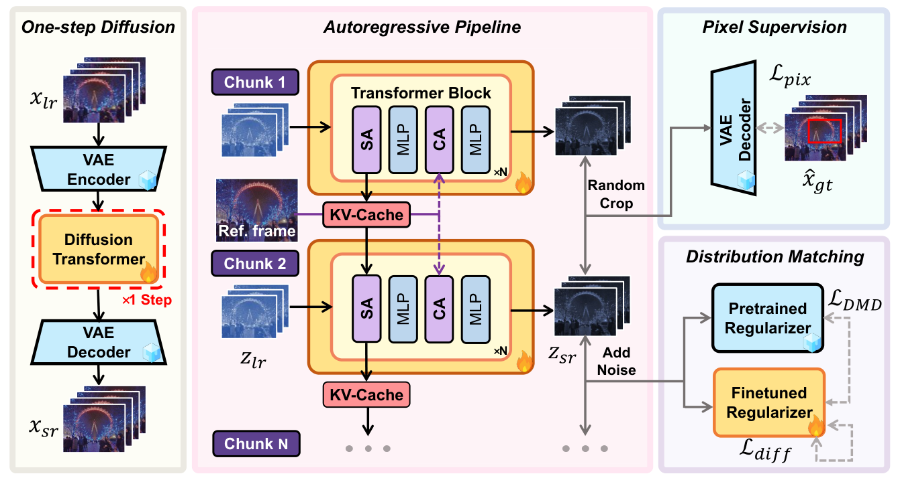
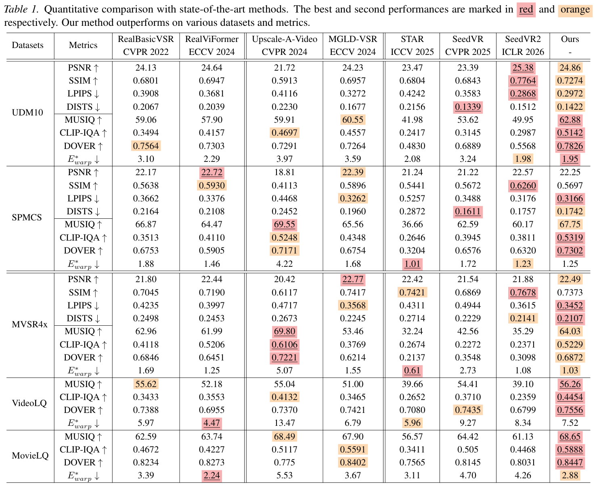
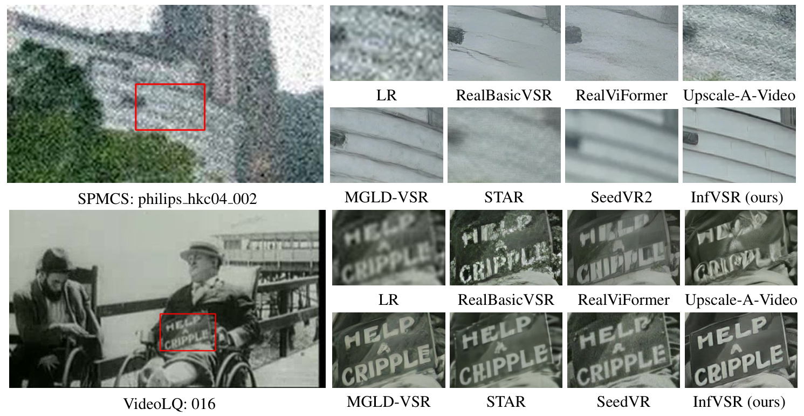
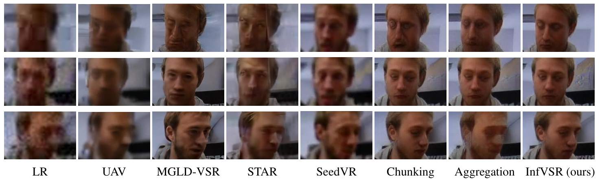
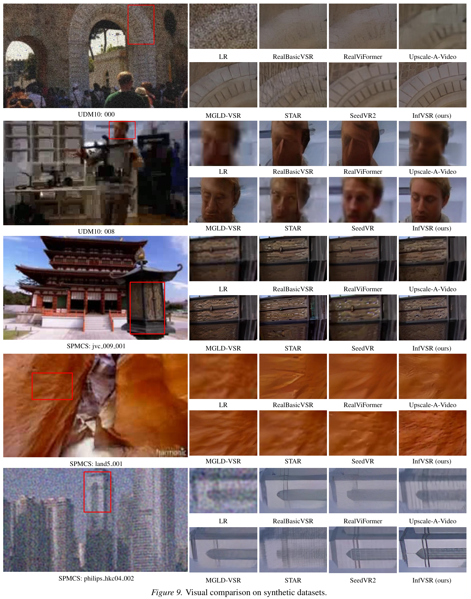
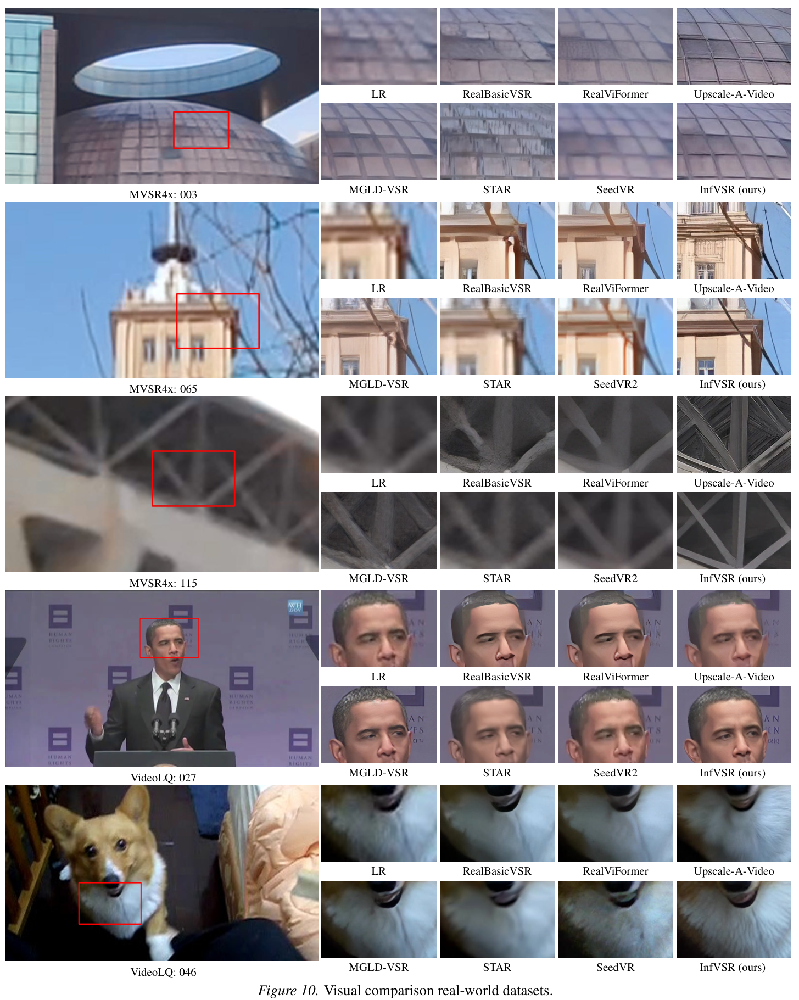

# InfVSR: Breaking Length Limits of Generic Video Super-Resolution

[Ziqing Zhang](https://github.com/sjtuzzq), [Kai Liu](https://kai-liu001.github.io/), [Zheng Chen](https://zhengchen1999.github.io), [Xi Li](), [Yucong Chen](https://scholar.google.com/citations?user=BTEsUk8AAAAJ&hl), [Bingnan Duan](https://github.com/Bingnan), [Linghe Kong](https://www.cs.sjtu.edu.cn/~linghe.kong/), and [Yulun Zhang](http://yulunzhang.com/), "InfVSR: Breaking Length Limits of Generic Video Super-Resolution", ICML, 2026

<div>
  <a href="https://github.com/Kai-Liu001/InfVSR" target="_blank" style="text-decoration: none;">
    
  </a>
  <a href="https://github.com/Kai-Liu001/InfVSR/stargazers" target="_blank" style="text-decoration: none;">
    
  </a>
</div>

[[arXiv](https://arxiv.org/abs/2510.00948)] [[supplementary material](https://github.com/Kai-Liu001/InfVSR/releases/tag/supp)] [dataset] [pretrained model]


#### 🔥🔥🔥 News

- **2026-05-01:** InfVSR is accepted by ICML 26! ⭐️⭐️⭐️
- **2025-09-25:** This repo is released. ⭐️⭐️⭐️

---



> **Abstract:** Real-world videos often extend over thousands of frames. Existing video super-resolution (VSR) approaches, however, face two persistent challenges when processing long sequences: (1) Inefficiency due to the heavy cost of multi-step denoising for full-length sequences; and (2) poor scalability hindered by temporal decomposition that causes artifacts and discontinuities. To break these limits, we propose InfVSR, which novelly reformulate VSR as an autoregressive-one-step-diffusion paradigm. This enables streaming inference while fully leveraging pre-trained video diffusion priors. First, we adapt the pre-trained DiT into a causal structure, maintaining both local and global coherence via rolling KV-cache and joint visual guidance. Second, we distill diffusion process into a single step efficiently, with patch-wise pixel supervision and cross-chunk distribution matching. Together, these designs enable efficient and scalable VSR for unbounded-length videos. To fill the gap in long-form video evaluation, we build a new benchmark tailored for extended sequences, and further introduce semantic-level metrics to comprehensively assess temporal consistency. Our method pushes the frontier of long-form VSR, achieves state-of-the-art quality with enhanced semantic consistency, and delivers up to 58x speed-up over existing methods such as MGLD-VSR. Code will be available at https://github.com/Kai-Liu001/InfVSR .


## ⚒️ TODO
- [x] Release paper and supplementary material.
- [ ] Release video demo and project page.
- [ ] Release MovieLQ dataset.
- [ ] Release pretrained model and inference code.
- [ ] Release training code.
- [ ] Provide WebUI.
- [ ] Provide HuggingFace demo.


## 🔗 Contents


- [InfVSR: Breaking Length Limits of Generic Video Super-Resolution](#infvsr-breaking-length-limits-of-generic-video-super-resolution)
      - [🔥🔥🔥 News](#-news)
  - [Contents](#contents)
  - [Method](#method)
  - [Results](#results)
  - [Citation](#citation)
  - [Acknowledgements](#acknowledgements)

## <a name="method"></a>💡 Method 

<p align="center">
  
</p>

## <a name="results"></a> 🔎 Results

We achieved state-of-the-art performance. Detailed results can be found in the paper.

<details>
<summary>Click to expand</summary>

- quantitative comparisons in Table 3 (main paper)

<p align="center">
  
</p>


- visual comparison in Figure 4 (main paper)

<p align="center">
  
</p>


- visual comparison in Figure 6 (main paper)

<p align="center">
  
</p>


- visual comparison in Figure 2 (supplemental material)

<p align="center">
  
</p>

- visual comparison in Figure 3 (supplemental material)

<p align="center">
  
</p>

</details>

## <a name="citation"></a>📎 Citation
If you find the code helpful in your research or work, please cite the following paper(s).

```
@article{zhang2025infvsr,
  title={InfVSR: Breaking Length Limits of Generic Video Super-Resolution},
  author={Zhang, Ziqing and Liu, Kai and Chen, Zheng and Li, Xi and Chen, Yucong and Duan, Bingnan and Kong, Linghe and Zhang, Yulun},
  journal={arXiv preprint arXiv:2510.00948},
  year={2025}
}
```

## <a name="acknowledgements"></a> 💖 Acknowledgements

This project is based on [Wan2.1](https://github.com/Wan-Video/Wan2.1) and [DiffSynth-Studio](https://github.com/modelscope/DiffSynth-Studio). Thanks for their great work.
